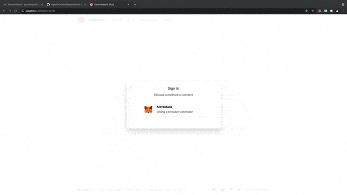

# decentraland-challenge

### Abstract
A company has created a token to manage the finances on its platform. They want to be able to manage their token on the Ethereum blockchain so they want a simple web application (dApp) to manage the token transfers. 

### Use cases of the application
1. The user must be able to connect their wallet to the dApp
2. The user must be able to see their balance of the token
3. The user must be able to transfer the token to another Etherum address

### Project tree:
- App.tsx
- src
	- components
		- Account/Table/Row
		-  Alert
		- Connect
		- Transfer
	- pages
		- Account
		- Accounts
		- Contract
	- redux
		- actions
		- calls
		- reducers
		- sagas
		- store
	- interfaces
	- contracts

### Main dependencies
- React
- React-router and React-router-dom
- Redux-Redux
- Redux-Saga
- Ethers.js
- Decentraland UI

### Demo (.gif)

